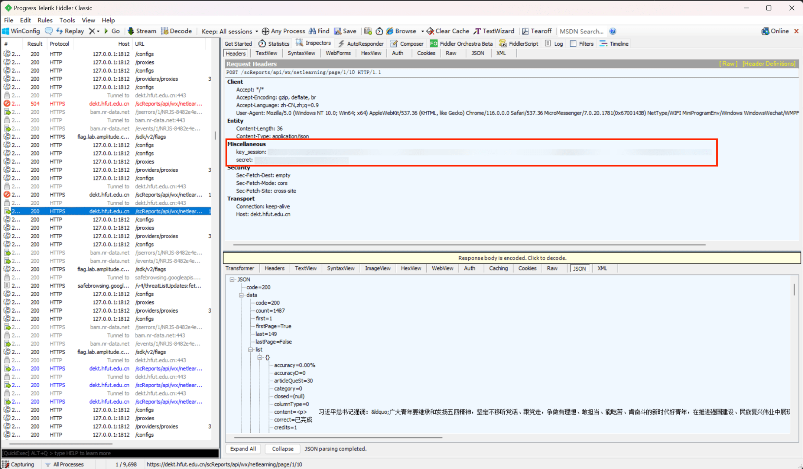

# HFUTSCNetworkStudy

A GitHub workflow to check in the second class of HFUT automatically uses GitHub Actions and Python, supporting single choice, multiple choice, and video questions.

## Table of Contents

- [Install](#install)
- [Usage](#usage)
- [Related Efforts](#related-efforts)
- [Maintainers](#maintainers)
- [License](#license)

## Install

### Local Install

You can install this project locally by following the steps below.

```shell
$ git clone https://github.com/RoiexLee/HFUTSCNetworkStudy.git
$ pip install -r requirements.txt
```

Then, you can run the script by using the [Local Usage](#local-usage).

### GitHub Actions Install

You can also install this project by using the GitHub Actions workflow.

See the [GitHub Actions Usage](#github-actions-usage) section for more information.

## Usage

### Get key_session and secret

1. Install Fiddler and configure the certificate. The process can be referred to [here](https://zhuanlan.zhihu.com/p/410150022).
2. Install the PC version of WeChat and enter the second class of HFUT to capture the package.
3. Log in and enter the network learning module, click on an article, and exit. *(The header has a secret only when entering the article)*

   

### Local Usage

```shell
$ python checkin.py --key_session <key_session> --secret <secret> --page_max 1
```

### GitHub Actions Usage

1. Fork this repository.
2. Add the following secrets in the repository settings, move to GitHub respiratory `Settings > Secrets and variables > Actions > New Repository secret`.
    - `KEY_SESSION`: Required, the `Secret` is the value of `key_session`.
    - `SECRET`: Required, the `Secret` is th value of `secret`.
3. Star the repository you Forked.

## Related Efforts

- [SecondClass](https://github.com/Zirconium233/SecondClass) - A Python script to check in the second class of HFUT automatically.

## Maintainers

[@RoiexLee](https://roiexlee.github.io).

## License

[GPL-3.0](./LICENSE) © [RoiexLee](https://roiexlee.github.io) 